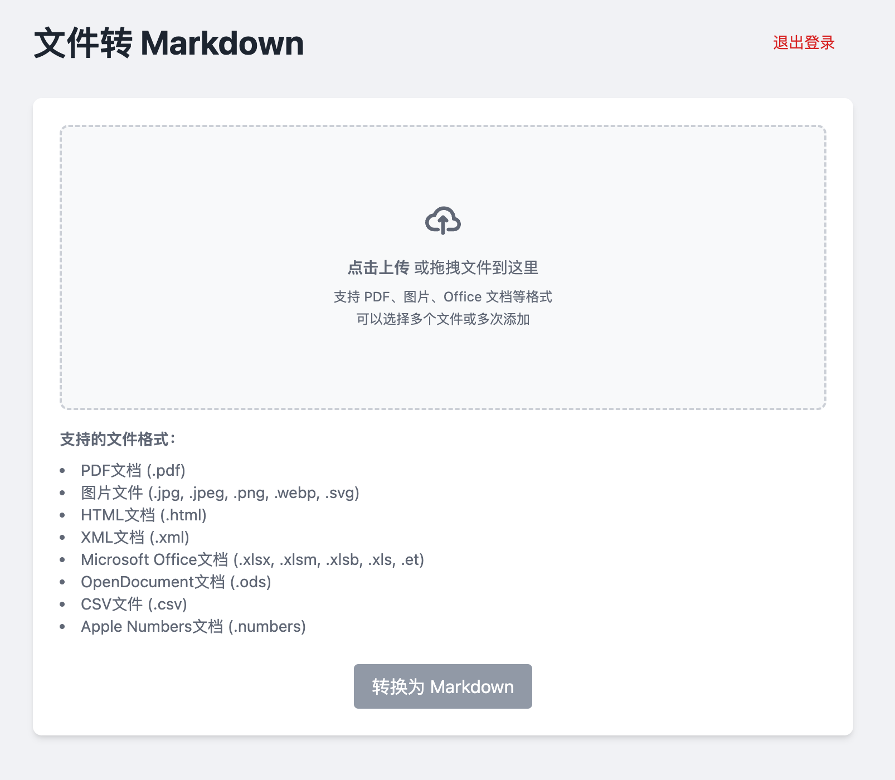
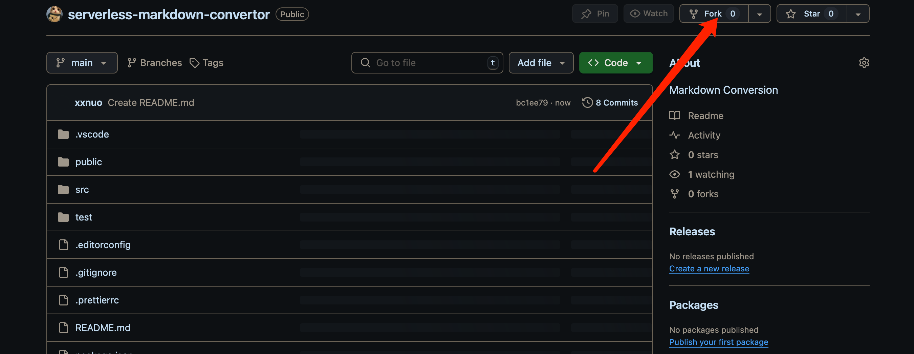
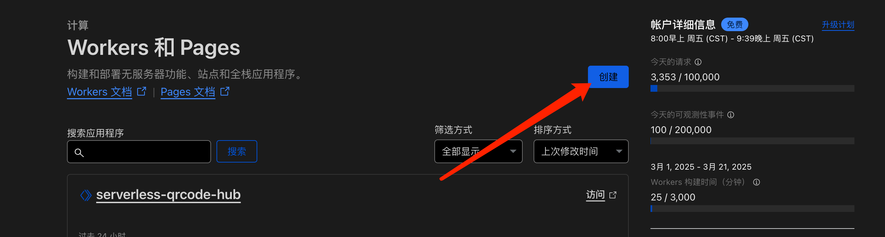
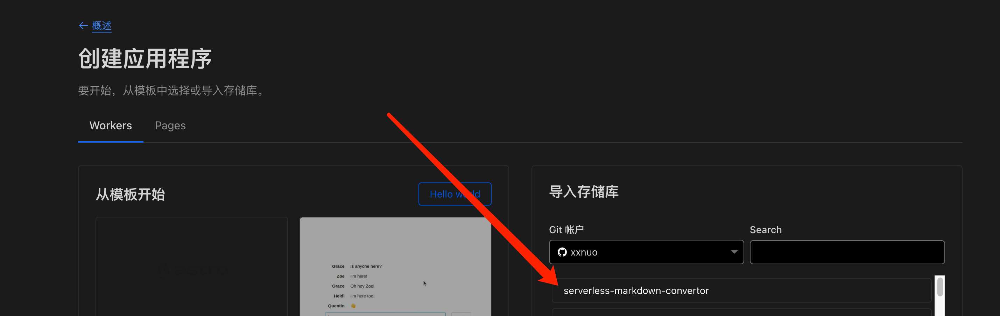
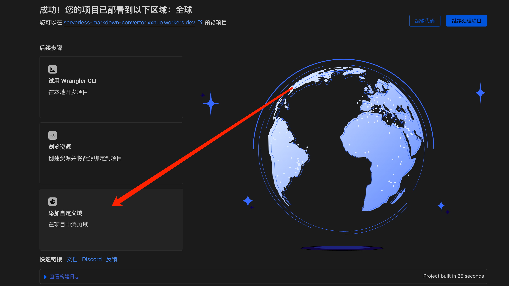
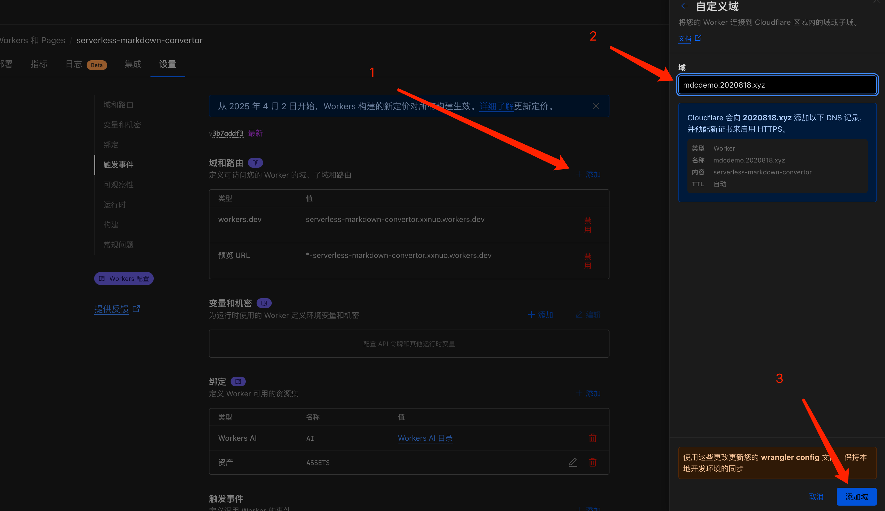
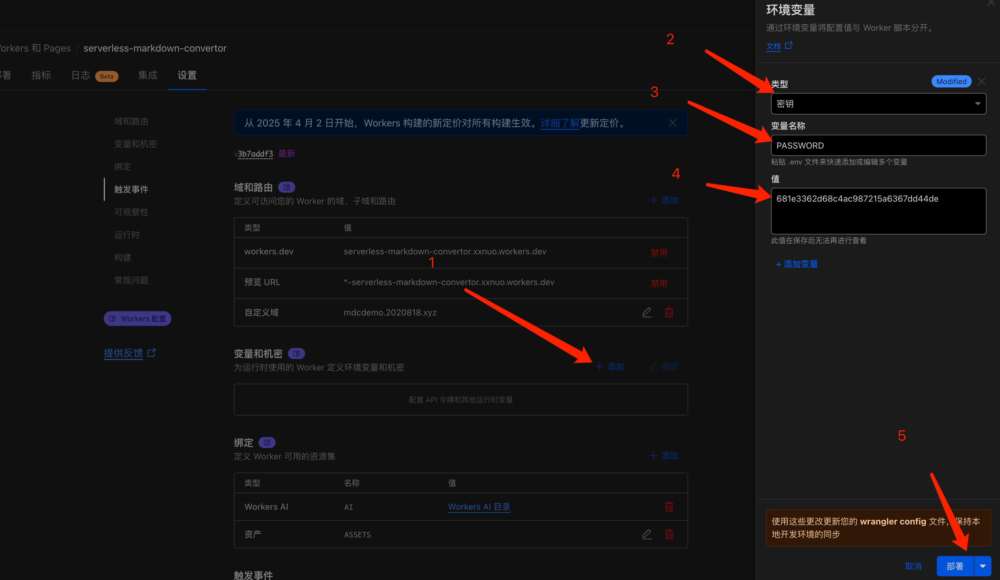

# 网页版文件转 Markdown 转换器

基于 Cloudflare Worker 和 AI 的免费、无需服务器可自行部署的文件转 Markdown 工具。

## 支持的文件类型

| 文件类型 | 文件扩展名 | MIME 类型 |
|---------|-----------|-----------|
| PDF 文档 | `.pdf` | `application/pdf` |
| 图片*1 | `.jpeg`、`.jpg`、`.png`、`.webp`、`.svg` | `image/jpeg`、`image/png`、`image/webp`、`image/svg+xml` |
| HTML 文档 | `.html` | `text/html` |
| XML 文档 | `.xml` | `application/xml` |
| Microsoft Office 文档 | `.xlsx`、`.xlsm`、`.xlsb`、`.xls`、`.et` | `application/vnd.openxmlformats-officedocument.spreadsheetml.sheet` `application/vnd.ms-excel.sheet.macroenabled.12` `application/vnd.ms-excel.sheet.binary.macroenabled.12` `application/vnd.ms-excel` |
| 开放文档格式 | `.ods` | `application/vnd.oasis.opendocument.spreadsheet` |
| CSV | `.csv` | `text/csv` |
| 苹果文件 | `.numbers` | `application/vnd.apple.numbers` |

> Cloudflare 对于大多数[格式转换](https://developers.cloudflare.com/workers-ai/markdown-conversion/)都是免费的。在某些情况下，例如图像转换，它可以使用 Workers AI 模型进行对象检测和摘要，如果超出 Workers AI 免费分配限制，则可能会产生额外费用。有关更多详细信息，请参阅[定价页面](https://developers.cloudflare.com/workers-ai/platform/pricing/)。

# Demo 演示

<a href="https://mdcdemo.2020818.xyz" target="_blank">Demo 演示地址</a>

密码：`681e3362d68c4ac987215a6367dd44de`

> 注意如果被用的太多，这个 Demo 随时可能关闭，建议自行部署。

# 部署方法

1. Fork [本项目](https://github.com/xxnuo/serverless-markdown-convertor)

2. 前往 Cloudflare 创建 Worker

3. 选择你 Fork 的项目仓库

4. 直接点击保存并部署项目

5. 等待部署完成自动跳转，点击添加自定义域

6. 添加你的自定义域名

7. 添加密码保护然后部署，注意设置一个强密码，否则有可能被人刷出天价账单！

8. 部署完成后，访问你设置的自定义域名或者系统自动分配的域名，输入密码即可使用！

